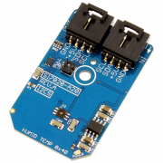

# Si7020-A20

The Si7020 offers an accurate, low-power, factory-calibrated digital solution ideal for measuring humidity, dew-point, and temperature, in applications ranging from HVAC/R and asset tracking to industrial and consumer platforms. The Mini Module form factor delivered by NCD is ideal for rapid prototyping and hobbyist applications, employing a simple I2C connector to make this device more accessible on all computing platforms.

The Mini Module pictured above can be found [here](https://store.ncd.io/product/si7020-a20-humidity-and-temperature-sensor-%C2%B14rh-%C2%B1-4c-i2c-mini-module/)

You can find additional information about this repository in the programming language folders.
